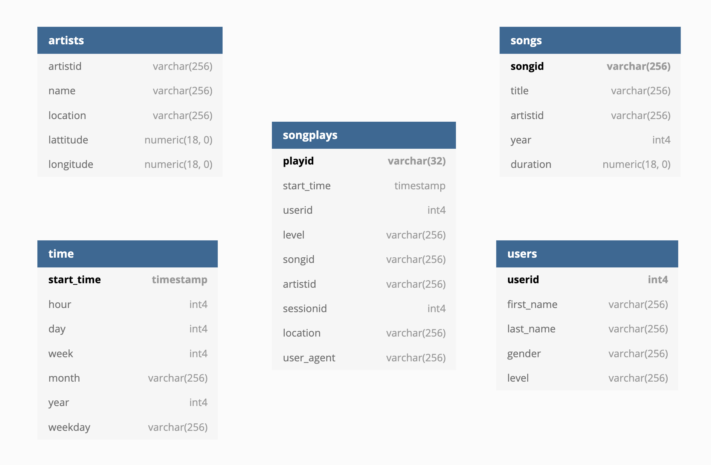

### Project 5: Data Pipelines with Airflow

<p align="center"></p>

### Introduction
In this project I'll be building Data ware house and pipeline by using Apachec AirFlow for Sparkify. The pipeline will run every hour and will push data to redshift for analysis/analytics purpose. 

### Technologies, Langauge and  Software used. 
- **Python:** Python is an interpreted, high-level, general-purpose programming language.
- **Redshift:** Amazon Redshift is an Internet hosting service and data warehouse product which forms part of the larger cloud-computing platform Amazon Web Services.
- **Apache AirFlow:** Apache Airflow is an open-source workflow management platform.

Airflow uses directed acyclic graphs (DAGs) to manage workflow orchestration. Tasks and dependencies are defined in Python and then Airflow manages the scheduling and execution. DAGs can be run either on a defined schedule (e.g. hourly or daily) or based on external event triggers 

Following is a workflow of Pipeline in Graph View. 
<p align="center"></p>


### Operators
- **Staging Operator:** Using Airflow's PostgreSQL & S3 hooks, data is read and copied to staging tables in redshift.
- **Fact & Dimension Operators:** Using Airflow's PostgreSQL hook and variable SQL statements, staging data is transformed into a star schema database and stored in appropriate tables in redshift.
- **Data Quality Operator:** Using Airflow's PostgreSQL hook to access the newly transformed data, custom SQL commands are run against the tables to detect discrepancies within the newly formed data warehouse.

### Dataset
```
song_data/A/B/C/TRABCEI128F424C983.json
song_data/A/A/B/TRAABJL12903CDCF1A.json
```
#### Song JSON data 
```json
{"num_songs": 1, "artist_id": "ARJIE2Y1187B994AB7", "artist_latitude": null, "artist_longitude": null, "artist_location": "", "artist_name": "Line Renaud", "song_id": "SOUPIRU12A6D4FA1E1", "title": "Der Kleine Dompfaff", "duration": 152.92036, "year": 0}
```

#### Log Dataset
```
log_data/2018/11/2018-11-12-events.json
log_data/2018/11/2018-11-13-events.json
```
Schema for Sparkify Analysis

<p align="center"></p>

<p align="center"></p>


### Fact Table
- **songplays** - records in log data associated with song plays i.e. records with page NextSong  
`songplay_id, start_time, user_id, level, song_id, artist_id, session_id, location, user_agent`

### Dimension Tables
- **users** - users in the app  
    `user_id, first_name, last_name, gender, level`
- **songs** - songs in music database
    `song_id, title, artist_id, year, duration`
- **artists** - artists in music database  
    `artist_id, name, location, lattitude, longitude`
- **time** - timestamps of records in songplays broken down into specific units
    `start_time, hour, day, week, month, year, weekday`