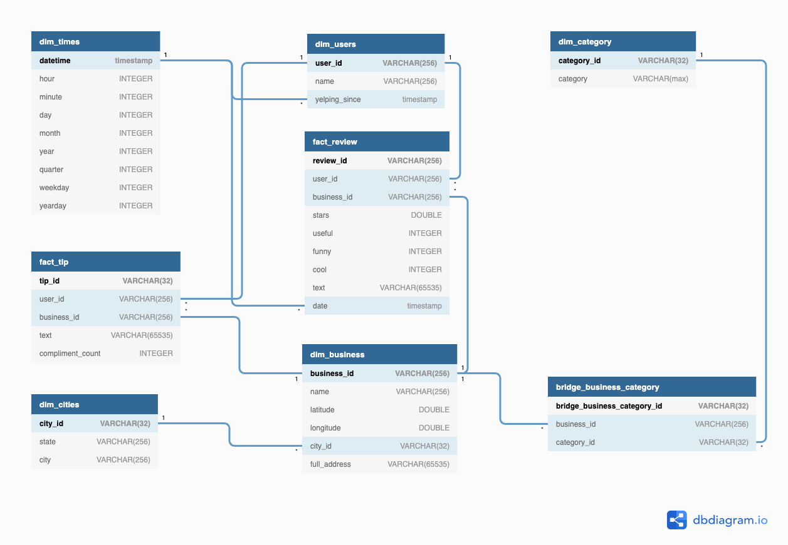
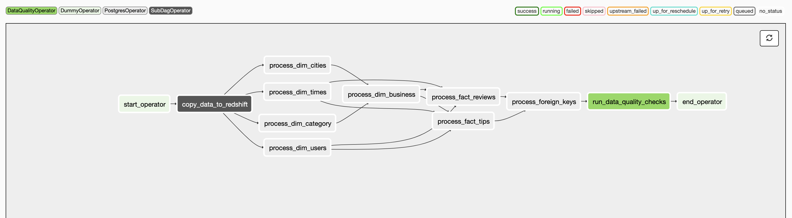
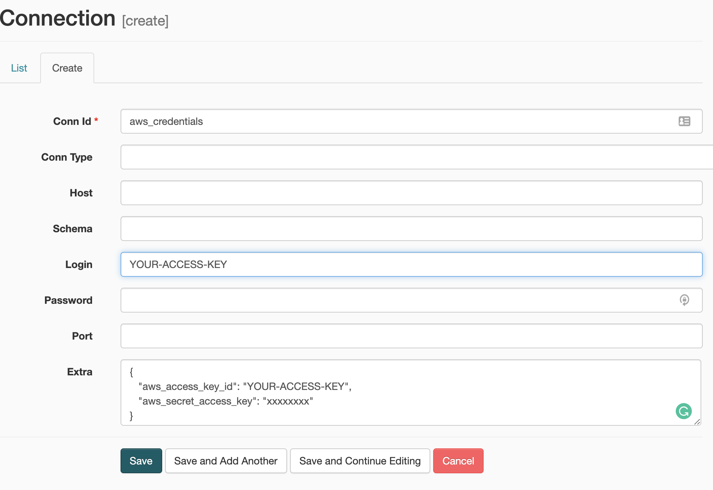
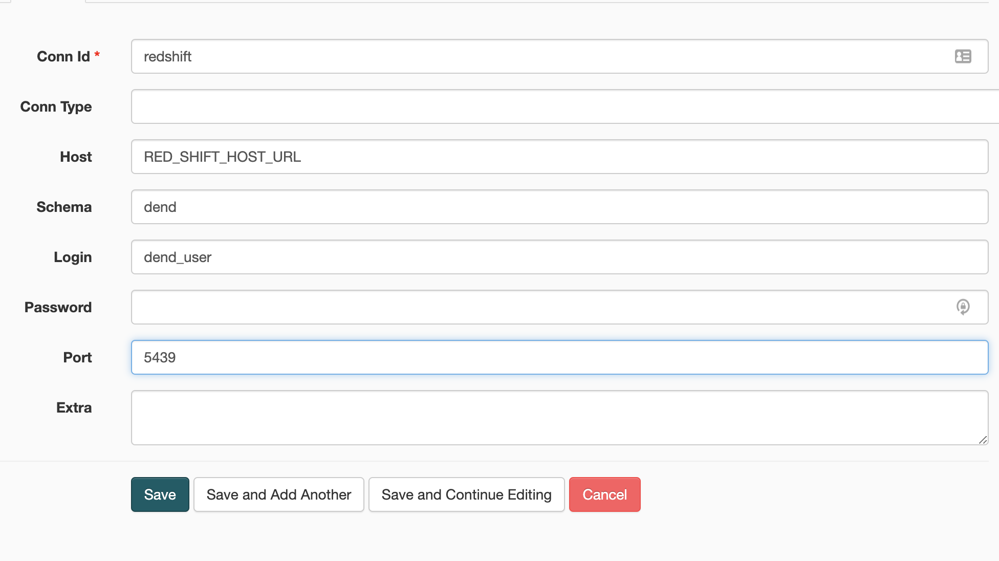

# DEND - Capstone Project

## Introduction
This is the final project for the Data Engineer Nanodegree. Udacity gives us the option to use their suggested project or pick one dataset and scope it by ourselves. In my case I went for the second option. The dataset I will use on this project is from a service called [Yelp](https://www.yelp.ie), which basically stores business reviews given by customers.

## Dataset
The dataset was found on [Kaggle](https://www.kaggle.com/yelp-dataset/yelp-dataset) and was uploaded by Yelp team for a competition called **Yelp Dataset Challenge** which they were looking users to analyse their data and find interesting patterns or insights using NLP techniques (sentiment analysis for instance) and graph mining.

According to the description, in total there are:

- 5,200,000 user reviews
- Information on 174,000 businesses
- The data spans 11 metropolitan areas

At the Kaggle page, there is a link for some [documentation](https://www.yelp.com/dataset/documentation/json), which unfortunately is not available anymore.

### Source Files
There are in total five JSON files included in the original data source:
- `yelp_academic_dataset_business.json`
- `yelp_academic_dataset_checkin.json`
- `yelp_academic_dataset_review.json`
- `yelp_academic_dataset_tip.json`
- `yelp_academic_dataset_user.json`

I eventually pre-process `yelp_academic_dataset_business.json` to make it a `csv` file, as the project request at least two different files format.

### Storage
The files were uploaded to a [S3 bucket](s3://udacity-dend-mukesh-output/yelp-dataset/). The total space utilised on that bucket is approximately 8 gb, which is a considerable amount of data.


## Project Scope
The scope of this project is to read data from Amazon S3 and load it on Amazon Redshift, later process the data in order to create dimensions and facts.

Finally some data quality checks are applied.

The idea is to create dimensions and facts following the `Snowflake` schema as some of the relationships are many-to-many which is not supported by Star Schema.

The outcome is a set of tables that make easier complex queries and at the same time tidy the data.


## Tooling
The tools utilised on this project are the same as we have been learning during the course of this Nanodegree.

- `Amazon S3` for File Storage
- `Amazon Redshift` for Data Storage
- `Apache Airflow` as an Orchestration Tool

Those tools are widely utilised and considered industry standards. The community is massive and the tools provide support to several features.

Apache Airflow, in special, gives freedom to create new plugins and adapt it to any needs that we might have. There are also several plugins available to use.

## Data Model and Data Dictionary
The final data model include seven tables, being five of them dimensions and two facts.



As mentioned, the schema is closer to Snowflake as we have many-to-many relationships, covered by a bridge table.

- `dim_users` stores information about the users.
- `dim_times` has information about times. It makes easier to process aggregation by time.
- `dim_cities` stores information about dim_cities
- `dim_business` has information about the business that receive reviews or tips by Yelp users.
- `dim_category` has information about categories. One business may have many categories and that's why there is a table called `bridge_business_category`.


## Scenarios
The following scenarios were requested to be addressed:

1. **The data was increased by 100x.** That wouldn't be a technical issue as both Amazon tools are commonly utilised in huge amount of data. Eventually the Redshift cluster would have to grow.

2. **The pipelines would be run on a daily basis by 7 am every day.** That's perfectly plausible and could be done utilising Airflow `DAG`· definitions.

3. **The database needed to be accessed by 100+ people.** That wouldn't be a problem as Redshift is highly scalable.

## Data Pipeline
The Data pipeline is spread into twelve tasks, being:
1. `start_operator` and `end_operator` are just dummy tasks, starting and finishing the execution.
2. `copy_data_to_redshift` is a `SubDagOperator` task. The Subdag will copy the date from S3 to Redshift.
3. `process_dim_times`, `process_dim_users`, `process_dim_cities`, `process_dim_category`, `process_dim_business`, `process_fact_reviews` and `process_fact_tips` are tasks that will run `SQL` statement to create and populate the dimensions and facts.
4. `process_foreign_keys` will just create the foreign keys between the tables. This is not done on the creation due to the sequence of the execution.
5. `run_data_quality_checks` will execute Data Quality against the data.



### Data Ingestion
The first step is read the data from S3 into Redshift. This is done through the `S3ToRedshiftOperator`. In this project I've decided to use a plugin that is available at the [Airflow-Plugins](https://github.com/airflow-plugins/redshift_plugin) Github page.

That plugin has some advantages over the `contrib` option, like the automatic creation of the tables.

This process is handle by a `SubDag`     

That SubDag is dynamically generated according to the configuration file `/dags/configuration/copy_from_s3_to_redshift.py`. It means that if more tasks are needed then all that is required is to add new details to that file.

### Data Processing

The data processing is made exclusively through SQL statements. Each task has a SQL file that seats on `dags/sql`.
The purpose is to make simpler to modify the queries without the need of change the code. It allows also to create templated SQL statement.

An example of a SQL statement can be found on following. Every SQL script will follow the same pattern.

1. Drop the table if exists
2. Create the table
3. Insert the data from a select statement.

```sql
DROP TABLE IF EXISTS dim_business CASCADE;

CREATE TABLE IF NOT EXISTS dim_business
(
  business_id VARCHAR(256) NOT NULL,
  name VARCHAR(256) NOT NULL,
  latitude DOUBLE PRECISION,
  longitude DOUBLE PRECISION,
  city_id VARCHAR(32) NOT NULL,
  full_address VARCHAR(65535),
  PRIMARY KEY (business_id)
)
DISTSTYLE EVEN;

INSERT INTO dim_business
select
  b.business_id,
  b.name,
  b.latitude,
  b.longitude,
  c.city_id,
  b.full_address
FROM
staging_business b
LEFT JOIN dim_cities c on b.state = c.state AND b.city = c.city;
```

## Running the Project
It's assumed that there is an Airflow instance up and running.
- Copy `dags` and `plugins` files to Airflow work environment.

### Create AWS connection
Setup a new connection on Airflow called `aws_credentials` according to the following example.


It's important to fill the Extra field with the respective `aws_access_key_id` and `aws_secret_access_key` as a JSON object. This is necessary and the DAG won't work without that configuration.

```JSON
{
   "aws_access_key_id": "YOUR-ACCESS-KEY",
   "aws_secret_access_key": "xxxxxxxx"
}
```

### Create Redshift Connection
Setup a new connection on Airflow called `redshift`, according to the following example.



### Execute the DAG
Having the configuration finished, then just turn the DAG on and run it manually.
